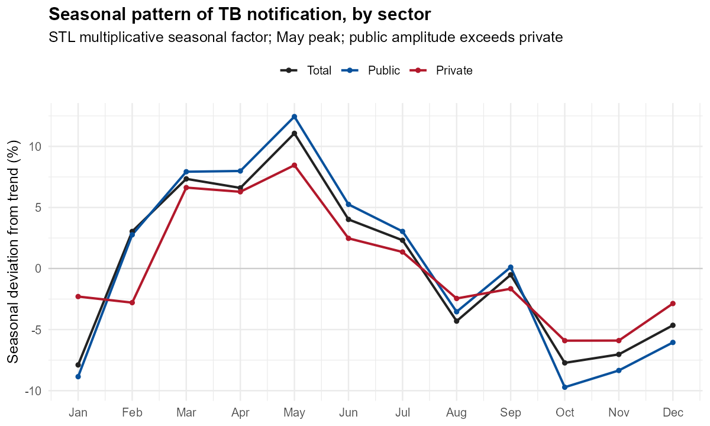
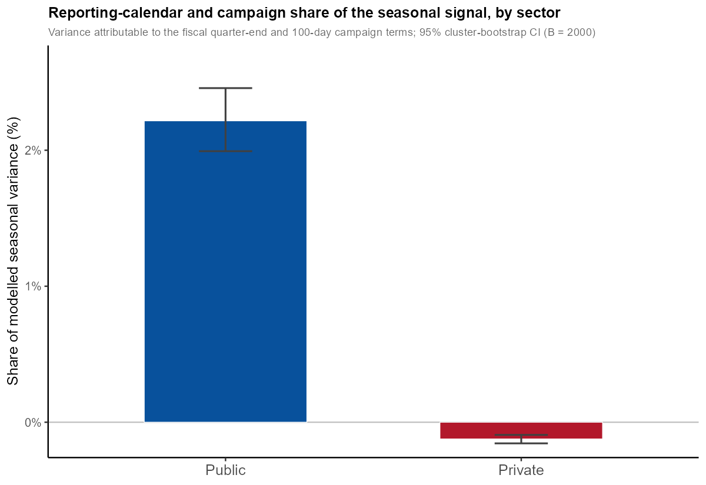
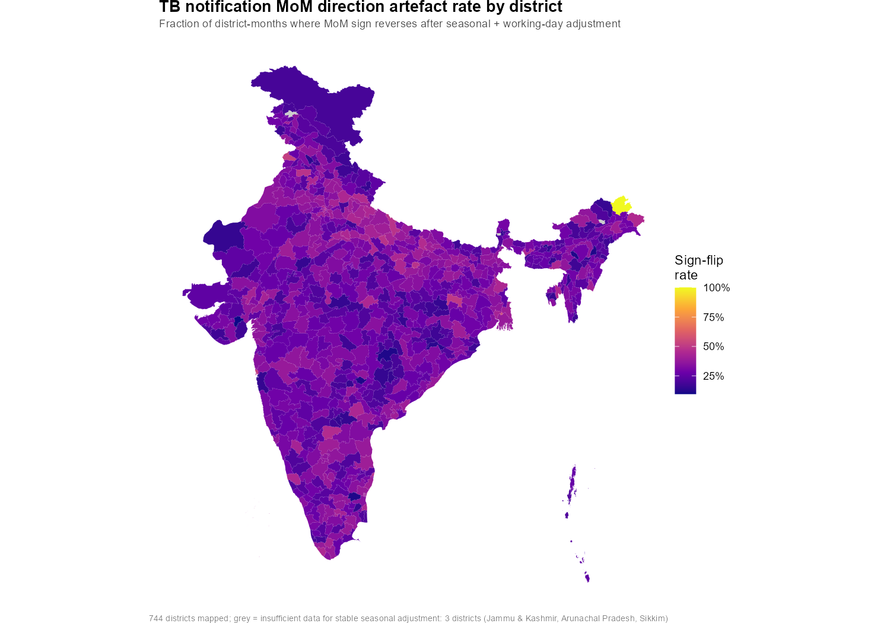
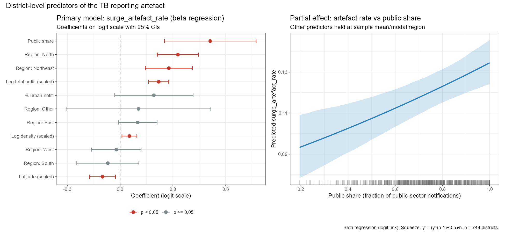

> Draft v1 (2026-06-12). Longitudinal ecological analysis of monthly TB notification, January 2022 to 2025, at the district level (747 Local Government Directory districts with an active TB Unit). Reporting follows STROBE. The ethics approval number is to be inserted before submission.

## Abstract

**Background.** Tuberculosis notification in India shows a recurring spring peak that is generally read as disease seasonality. Because a notification is the product of both an epidemiological process and a reporting process, this seasonal signal may also carry a reporting-calendar artefact (fiscal quarter-end reporting, active case-finding campaigns, and month-length effects), but the two have not been separated.

**Methods.** We analysed monthly case-based notifications from the National TB Elimination Programme (Ni-kshay) for 7,028 active TB Units, January 2022 to 2025, aggregated to 747 districts. Seasonality was described by seasonal-trend decomposition (STL) nationally and by sector (public, private), with moving-block bootstrap confidence intervals. We then fitted sector-specific negative-binomial models with population and working-day offsets, harmonic seasonal terms, lagged climate covariates, and reporting-calendar and campaign terms, using the public-versus-private contrast as a discriminating test: a reporting artefact should concentrate in the target-driven public sector, whereas a shared seasonal process, whether in transmission or in care-seeking, should appear in both sectors and track climate. We partitioned the modelled seasonal variance into climate and calendar components, quantified the consequence for routine monitoring (the share of month-on-month changes that reverse after seasonal and working-day adjustment), and examined which district features predict where the artefact concentrates.

**Results.** Notification peaked in May nationally, with a seasonal amplitude of 19.0% (95% CI 16.5 to 24.7). Amplitude was larger in the public sector (22.2%, 95% CI 19.4 to 29.1) than the private sector (14.4%, 95% CI 12.2 to 19.6). Climate associations were near-identical across sectors (3-month-lagged temperature rate ratio about 0.99 in both), whereas the reporting-calendar and campaign terms were concentrated in the public sector: the 100-day campaign was associated with an 8.2% higher public-sector notification rate (p<0.001) but no change in the private sector (p=0.10), and the fiscal quarter-end term was larger in the public sector. The calendar and campaign block accounted for a small but statistically distinct share of the modelled public-sector seasonal variance (2.2%, 95% CI 2.0 to 2.5) and essentially none in the private sector (-0.1%, 95% CI -0.2 to -0.1), with non-overlapping intervals, while the climate share was similar across sectors. After seasonal and working-day adjustment, 29.5% of district-months reversed the direction of their month-on-month change, and 46.9% of raw month-on-month increases above 10% and 42.4% of decreases below -10% did not survive adjustment. The artefact concentrated in districts with a higher public-sector share of notification (p=0.0001), larger notification volume, and in the North and Northeast, and was not spatially autocorrelated.

**Conclusions.** India's spring TB-notification peak reflects a genuine, sector-shared seasonal signal together with a public-sector reporting-calendar and campaign component. The artefact is modest as a fraction of total seasonal variance but materially distorts month-on-month monitoring, so routine programme review should use seasonally and working-day adjusted notification rather than raw monthly change.

**Keywords:** tuberculosis; case notification; seasonality; surveillance; reporting bias; public-private sector; India.

---

## 1. Introduction

India carries the world's largest tuberculosis burden and runs a case-based notification system, Ni-kshay, that records monthly notifications from both public and private providers under the National TB Elimination Programme [@centraltbdivisionministryofhealthandfamilywelfaregovernmentofindia2024]. Notification undercounts true disease: the National TB Prevalence Survey implied a prevalence-to-notification ratio of about 2.84, and roughly a third of 2023 notifications came from the private sector after a decade of engagement effort [@prevalence_survey; @itr2023]. Programmes monitor these monthly notification counts closely, reading month-on-month change as a signal of programme performance and disease activity.

A notification is the product of two processes, an epidemiological one and a reporting one, and the monthly series that programmes watch carries both. Indian TB notification shows a recurring spring peak that is generally interpreted as disease seasonality [@tb_seasonality; @kumar2014trt; @yadav2023cjidmm]. If part of that pattern is instead a reporting-calendar artefact, driven by the April-to-March fiscal year and quarter-end reporting, by active case-finding campaigns, and by differences in working days across months, then routine monitoring that does not adjust for it will misread administrative fluctuation as epidemiological change. This matters because the programme acts on monthly movements, and a spurious surge or dip can misdirect attention and resources.

Existing evidence does not separate the two. The seasonality literature, including a systematic review and mathematical model, treats the spring peak as biological and rests its non-notification support on mortality and hospitalisation series that are confounded by influenza co-infection [@tedijanto2018e]. Cross-country notification studies document the spring peak but cannot distinguish biology from reporting [@willis2012cid; @wubuli2017po; @maclachlan2012eid]. The single study that re-dated the same cases by symptom onset rather than report date found the peak shifted about two months earlier, which is the artefact mechanism we describe, but it was conducted in the United Kingdom [@glaser2024ei]. Indian sub-national notification analyses stop before the case-based, both-sector era and do not examine seasonality at district resolution [@golandaj; @pardeshi]. No study has used the structure of the data, in particular the contrast between the target-driven public sector and the private sector, to test whether a meaningful part of the apparent seasonality is a reporting artefact.

We used 53 months of district-level Ni-kshay notification, covering both sectors, to ask how much of the seasonality in Indian TB notification reflects disease seasonality and how much reflects the reporting calendar. We aimed to: (1) describe the seasonal pattern of notification nationally and by sector; (2) decompose the seasonal signal into a climate-associated (biological) component and a reporting-calendar and campaign (artefact) component, using the public-versus-private contrast as the discriminating test; and (3) quantify the consequence for routine monitoring and identify which districts the artefact most affects.

## 2. Methods

### 2.1 Design and data
This was a longitudinal ecological analysis of monthly public, private, and total TB notifications per TB Unit from the NTEP Ni-kshay system, January 2022 to 2025. TU geocoding, urban-rural classification, and the exclusion of 60 inactive units follow the companion cross-sectional analysis (companion paper, under review); 7,028 active TB Units were analysed. Notifications were office-anchored, that is, attributed to the district of the registering TB Unit rather than the patient's residence, and aggregated to Local Government Directory districts, the level at which office-anchoring largely averages out. The analysis frame comprised the 747 districts with at least one active TB Unit. Eighteen districts created between 2012 and 2022 were folded into their pre-split parent districts, because their TB Units and notifications are recorded under the parent in the current directory vintage; two Pakistan-administered districts claimed by India are outside the programme and were excluded. District denominators were annual WorldPop population. All 7,028 active TB Units mapped to one of the 747 analysis districts; the national and sector models used all 747, and the district-level monitoring analysis (Section 3.3) covered the 744 with sufficient data for seasonal adjustment, the remaining 3 (in Jammu and Kashmir, Arunachal Pradesh, and Sikkim) having too few months or cases.

### 2.2 Reporting-lag handling
Recent months under-count because notifications are entered with delay. We flagged trailing months whose national total fell below 85% of the preceding 12-month median and treated them as incomplete; this affected only the final month. The core seasonality models were restricted to complete calendar months through 2025 to match the climate covariate coverage.

### 2.3 Covariates
Climate covariates (monthly mean and minimum temperature, relative humidity, precipitation, and surface solar radiation) were obtained per district from NASA POWER and entered at epidemiologically plausible lags. Reporting-calendar covariates were the number of working days per month (weekdays minus national gazetted holidays), an indicator for the fiscal quarter-end months (March, June, September, December), and an indicator for the fiscal year-end (March). A campaign indicator marked the months of the national 100-day intensified case-finding campaign, December 2024 to March 2025 [@centraltbdivisionmohfwgovernmentofindia2024ctdmohafw]. Active case-finding in India is a discrete, public-sector activity whose yield is measured against public-sector notification [@shewade2023gha].

### 2.4 Statistical analysis
Analyses used R 4.4.1 with the tidyverts and glmmTMB toolchains.

Objective 1. National and sector-specific monthly series were decomposed by seasonal-trend decomposition (STL) on the log scale, with a finite seasonal window, giving a multiplicative seasonal factor. We summarised the peak and trough month, the seasonal amplitude (the peak-to-trough difference as a percentage of the trend level), and the seasonal strength. Confidence intervals were obtained by a moving-block bootstrap (block length 12 months, 2,000 resamples).

Objective 2. For each sector we fitted a negative-binomial model (to accommodate overdispersion) of monthly district counts, with an offset of log population plus log working days, second-order Fourier seasonal terms, lagged climate covariates (lag selected by AICc), the reporting-calendar and campaign terms, a year term and a smooth post-pandemic trend, and a district random intercept. The working-day offset assumes monthly notification entry scales with the number of working days in a month; we examined this and the other key analytical choices in sensitivity analyses. Residual temporal autocorrelation was assessed by the Ljung-Box test; where present, an autoregressive term was added and the preferred model chosen by AICc. The discriminating test compared the reporting-calendar and campaign coefficients between sectors. This contrast identifies a reporting artefact under the assumption that private providers are not subject to the public sector's fiscal-year targets or to campaign mobilisation; any residual private-sector calendar response would bias the contrast toward the null. We then partitioned the modelled seasonal signal into harmonic, climate, and calendar-campaign blocks and expressed each block's contribution as its proportionate share of the seasonal variance, with a district cluster bootstrap (2,000 resamples).

Objective 3. For each district we computed the month-on-month change in raw notification and in the seasonally and working-day adjusted series, and the share of months whose change reversed sign or whose movement beyond +/-10% did not survive adjustment. We then regressed the per-district share of large increases that did not survive adjustment on district features (public-sector share of notification, latitude, population density, urban share, region, and notification volume) using beta regression, and checked the residuals for spatial autocorrelation (Moran's I on a queen-contiguity graph), refitting a spatial error model if indicated.

### 2.5 Ethics
[Institutional Ethics Committee approval number and date to be inserted.] The study used aggregate programmatic data with no individual identifiers.

## 3. Results

### 3.1 Seasonal pattern, nationally and by sector
Notification peaked in May and reached its trough in late autumn, with a national seasonal amplitude of 19.0% of the trend level (95% CI 16.5 to 24.7) and a high seasonal strength (0.79; @tbl-o1). The seasonal amplitude was larger in the public sector (22.2%, 95% CI 19.4 to 29.1) than in the private sector (14.4%, 95% CI 12.2 to 19.6); the bootstrap intervals were close to non-overlapping (@fig-seasonal). The spring peak is consistent with previous descriptions of Indian TB notification seasonality [@tb_seasonality; @kumar2014trt].

### 3.2 Disease signal versus reporting artefact
In the sector-specific models, climate associations were near-identical across sectors, consistent with a shared seasonal process present in both: the 3-month-lagged temperature term corresponded to a rate ratio of about 0.99 per degree in both sectors, with similarly small solar and humidity terms (@tbl-o2). The reporting-calendar and campaign terms, by contrast, were concentrated in the public sector. The 100-day campaign was associated with an 8.2% higher public-sector notification rate (rate ratio 1.082, p<0.001) but with no change in the private sector (p=0.10). The fiscal quarter-end term was positive in both sectors but larger in the public sector (a 2.9% higher rate, p<0.001, versus 1.6%, p=0.004), and the fiscal year-end (March) term was negative and larger in magnitude in the public sector. The private-sector model retained residual autocorrelation and was refitted with an autoregressive term, which was preferred.

Partitioning the modelled seasonal signal isolated the same contrast (@fig-partition). The reporting-calendar and campaign block accounted for a small but statistically distinct share of the public-sector seasonal variance (2.2%, 95% CI 2.0 to 2.5) and essentially none of the private-sector variance (-0.1%, 95% CI -0.2 to -0.1), with non-overlapping intervals. The remaining variance is the smooth annual cycle, carried jointly by the harmonic and climate terms and of similar size in both sectors; because those two terms both encode the annual cycle they are collinear, so we do not interpret their division. The artefact's small share of total seasonal variance and its large effect on month-on-month monitoring (Section 3.3) are not in tension: the calendar and campaign effects are concentrated in a few discrete months rather than spread across the smooth cycle, so they add little to annual variance while still dominating specific monthly movements. The campaign rate ratio and the monitoring consequences below are the interpretable measures of the artefact's size, not its share of annual variance.

### 3.3 Consequence for routine monitoring
Across the 744 of 747 districts with sufficient data for seasonal adjustment, 29.5% of district-months reversed the direction of their month-on-month change after seasonal and working-day adjustment (per-district median 28.8%, IQR 23 to 35). Of the raw month-on-month increases exceeding 10%, the kind of movement a programme might treat as a surge, 46.9% did not remain increases above 10% after adjustment; of the decreases beyond -10%, 42.4% did not survive (@fig-payoff). In other words, close to half of the large monthly movements visible in raw notification are attributable to seasonal and reporting-calendar structure rather than to a change in the underlying series.

### 3.4 Where the artefact concentrates
The share of large monthly increases that did not survive adjustment was higher in districts with a larger public-sector share of notification (beta-regression coefficient 0.51 on the logit scale, 95% CI 0.25 to 0.77, p=0.0001), corresponding to about a 2-percentage-point higher artefact rate across the observed range of public-sector share (@fig-hetero; @tbl-o3). The strongest predictor was notification volume, and rates were elevated in the North and Northeast and lower at higher latitude. Residuals showed no spatial autocorrelation (Moran's I 0.02, p=0.16), so the public-sector association was not a spatial confound. The public-sector association was specific to large increases and was not present for the overall sign-reversal rate, consistent with a mechanism driven by public-sector campaign and quarter-end surges rather than by general month-to-month volatility. It was unchanged after adjustment for district literacy and Scheduled-Caste and Scheduled-Tribe share from the 2011 Census (logit coefficient 0.51, 95% CI 0.22 to 0.80, in the 611 districts with a Census-2011 match), indicating that it is not explained by these structural differences between districts.

### 3.5 Sensitivity
The headline results were robust to the main analytical choices. The public-sector seasonal amplitude exceeded the private under both multiplicative (log) and additive STL, and the May peak was invariant. The campaign rate ratio was positive and significant in the public sector (1.08 to 1.10) and never positively associated in the private sector (0.97 to 0.98) across climate lags of zero and three months and whether working days entered as an offset or as a covariate; at a zero-month lag the private campaign term was significant but negative, not positive. The monitoring consequence was similar under STL-based and simple seasonal-index adjustment (sign reversal 29.5% versus 28.2%; large-increase artefact 46.9% versus 41.7%).

## 4. Discussion

India's spring peak in TB notification reflects a genuine seasonal signal that is shared across the public and private sectors, together with a public-sector reporting-calendar and campaign component that is statistically distinct but modest in size. The climate associations that may index the underlying seasonal cycle, whether in transmission or in care-seeking, were near-identical in the two sectors, whereas the reporting-calendar and campaign terms, and the campaign term in particular, appeared in the public sector and not the private sector. This is the pattern expected if active case-finding and fiscal reporting cycles, which operate on the public sector, add administrative structure on top of a real seasonal signal.

An alternative explanation deserves consideration. The public and private sectors serve different populations and case mixes, so a larger public-sector amplitude could in part be genuine rather than artefactual. Recently transmitted and paediatric disease is more seasonal than reactivation disease [@willis2012cid], and the public sector may capture more such cases. This alternative can account for a larger public-sector seasonal amplitude and a stronger quarter-end pattern, but it cannot account for the campaign association, which is tied to a specific, datable, public-sector intervention rather than to any standing difference in the populations served. The campaign result is therefore the discriminating evidence; the amplitude and quarter-end contrasts are consistent with the reporting-artefact account but remain open to a case-mix interpretation.

These findings extend the seasonality literature, which has treated the spring peak as biological and has lacked direct evidence from data independent of notification reporting [@tedijanto2018e]. The one study that re-dated cases by symptom onset rather than report date found the peak shifted about two months earlier, the same direction our reporting-artefact account predicts [@glaser2024ei], and the strongest genuinely onset-dated and mortality-based evidence peaks in late winter to early spring, earlier than the notification peak [@wingfield2014jid; @zurcher2016po]. A cohort that attributed its monthly variation to clinic holiday closures rather than to climate makes the same point from the reporting side [@ballif2018bo]. The vitamin D pathway sometimes invoked for biological seasonality is associational and is not supported by trial evidence [@aibana2019pm; @ganmaa2020nejm]. Methodologically, the separation of disease signal from reporting-calendar effects has precedent in syndromic surveillance, where day-of-week and public-holiday corrections are standard [@buckingham-jeffery2017bph], but it has not previously been applied to TB notification.

The findings carry a direct programmatic implication. Because close to half of the large month-on-month movements in raw notification did not survive seasonal and working-day adjustment, routine programme review that reacts to unadjusted monthly change will frequently act on administrative fluctuation. Monitoring should use seasonally and working-day adjusted notification, and the adjustment matters most in high-volume, public-sector-reliant districts and during campaign and quarter-end months.

This study has limitations. Office-anchoring attributes notification to the registering district and is only partly mitigated by working at district level. Notification is not incidence, but here that is the object of study rather than a nuisance, because the question concerns the notification signal that programmes actually monitor. The climate covariates index but do not prove the biological component, and the harmonic and climate terms are collinear, so individual variance shares should not be over-interpreted; the sector contrast and the monitoring consequence are the robust results. A competing seasonal driver, respiratory co-infection, could not be measured at district-month resolution because the relevant surveillance data are not openly available, and Ni-kshay does not record a symptom-onset date, so the onset-versus-report re-dating that would test the shift directly was not possible in this dataset. Adjustment for district socio-demography was restricted to Census 2011 structural covariates (literacy and Scheduled-Caste and Scheduled-Tribe share), which left the public-sector-share association unchanged; NFHS-5 district micro-indicators such as undernutrition and household fuel were not programmatically accessible and could not be included, and the Census adjustment was confined to the 611 districts with a 2011 match. Three districts with very sparse notification, fewer than two years of data or very low monthly counts, could not support stable seasonal adjustment and are omitted from the district-level payoff analysis.

India's spring TB-notification peak is partly genuine seasonality and partly a public-sector reporting-calendar and campaign artefact. The artefact is small as a share of total seasonal variance but distorts a large fraction of the month-on-month movements that programmes monitor, so routine surveillance should read seasonally and working-day adjusted notification rather than raw monthly change.

## Figures and tables

```{r}
#| label: tbl-o1
#| tbl-cap: "Seasonal pattern of monthly TB notification, national and by sector (STL on log counts; moving-block bootstrap 95% CIs)."
library(readr); library(dplyr); library(knitr)
o1 <- tryCatch(read_csv("../out/o1_seasonal_national.csv", show_col_types = FALSE), error = function(e) NULL)
if (!is.null(o1)) kable(o1)
```

::: {#fig-seasonal}
{width=85%}

Seasonal factor of monthly TB notification by calendar month, national and by sector (STL multiplicative seasonal component). The peak is in May and the public-sector amplitude exceeds the private. Amplitudes with 95% confidence intervals are given in @tbl-o1.
:::

::: {#fig-partition}
{width=85%}

Reporting-calendar and campaign share of the modelled seasonal variance, by sector, with 95% cluster-bootstrap confidence intervals. The share is public-specific: positive in the public sector and indistinguishable from zero in the private sector. The remaining variance is the smooth seasonal cycle, carried jointly by the collinear harmonic and climate terms and not separately interpreted.
:::

::: {#fig-payoff}
{width=80%}

District-level rate at which the month-on-month direction of notification reverses after seasonal and working-day adjustment. Three districts (in Jammu and Kashmir, Arunachal Pradesh, and Sikkim) with fewer than two years of data or very low monthly counts could not support stable seasonal adjustment and are shown grey.
:::

::: {#fig-hetero}
{width=85%}

District features associated with the share of large monthly increases that do not survive seasonal and working-day adjustment (beta regression), and the partial effect of public-sector share.
:::

```{r}
#| label: tbl-o2
#| tbl-cap: "Sector-specific notification rate ratios for the reporting-calendar/campaign and climate covariates (negative-binomial models with population and working-day offsets; private sector with an AR(1) term)."
o2 <- tryCatch(read_csv("../out/o2_coefficients.csv", show_col_types = FALSE), error = function(e) NULL)
if (!is.null(o2)) kable(o2)
```

```{r}
#| label: tbl-o3
#| tbl-cap: "District features associated with the per-district share of large month-on-month increases that do not survive seasonal and working-day adjustment (beta regression, primary model). Estimates on the logit scale."
o3 <- tryCatch(read_csv("../out/o3_heterogeneity.csv", show_col_types = FALSE), error = function(e) NULL)
if (!is.null(o3)) {
  o3 |>
    dplyr::filter(model == "surge_artefact_betareg", term != "(Intercept)") |>
    dplyr::transmute(Term = term, Estimate = round(estimate, 3),
                     `95% CI` = sprintf("%.3f to %.3f", ci_lo, ci_hi), p = signif(p, 2)) |>
    kable()
}
```

## Data and code availability

The analysis used TB notification counts reported through the NTEP Ni-kshay system and aggregated to the TB Unit level; these programmatic data are governed by the National TB Elimination Programme and are not publicly redistributable at facility level. District-level aggregates underlying the figures are provided in the Supplementary material. Climate (NASA POWER), population (WorldPop), and settlement layers are publicly available from the cited sources. The full analysis code (R) and the district-level data are available at [repository URL].

## References {.unnumbered}

::: {#refs}
:::
